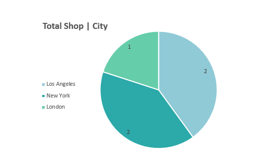

# 📊 Coffee Shop Report

This report provides a comprehensive view of hiring trends, gender distribution, salary insights, and operational data across our coffee shops in London, New York, and Los Angeles.

---

## 📁 Folder Structure

- **Coffee Report:**  
  Main SQL code for table creation and analysis.

- **Images:**  
  Visualizations used in the analysis.

--- 

## 📈 Yearly Hiring Trends (2010–2023)

- **2010–2019**: Consistent growth in hiring, peaking in **2019 with 90 hires**, indicating strong business expansion.
- **2020–2022**: Hiring plateaued between **74–76 hires**, reflecting a more cautious approach during uncertain times.
- **2023**: Significant drop to **27 hires** (**-63.5% YoY**), suggesting potential concerns in business confidence or operational priorities. This requires immediate attention and strategic review.


``` sql
SELECT 
	EXTRACT(YEAR FROM hire_date) AS Hired_Year,
	COUNT(employee_id) AS total_employees
FROM employees
GROUP BY 
	Hired_Year
ORDER BY 
	Hired_Year ASC;

```


---

## 📉 Hiring Growth Analysis

- **2010–2014**: Steady growth, reaching **84 hires in 2014** (+15% YoY).
- **2015–2018**: Volatile period with sharp drops in 2015 and 2017; brief recovery in 2016.
- **2019**: Peak year with **25% YoY growth**, likely driven by new initiatives.
- **2020–2022**: Stabilized hiring suggests operational caution.
- **2023**: Drastic decline emphasizes the need to reassess hiring strategy.

``` sql
WITH hired_year AS (
    SELECT 
        EXTRACT(YEAR FROM hire_date) AS hired_years,
        COUNT(employee_id) AS hired_total
    FROM 
        employees
    GROUP BY 
        hired_years
)
SELECT 
    hired_years,
    hired_total,
    hired_total - LAG(hired_total) OVER (ORDER BY hired_years) AS YoY_Growth,
    ROUND((hired_total - LAG(hired_total) OVER (ORDER BY hired_years)) * 100.0 
        / NULLIF(LAG(hired_total) OVER (ORDER BY hired_years), 0), 2) AS YoY_Growth_Percent
FROM hired_year;

```


---

## 👥 Gender Distribution & Pay Equity

- Workforce is **nearly gender-balanced**:  
  - **515 females**, **485 males**
- **Average salary gap**:  
  - Males: **$38,778**  
  - Females: **$37,619**
- While the gap is relatively small, it signals the importance of reviewing compensation policies for fairness and transparency.


``` sql

SELECT 
	gender,
	count(employee_id) AS total_employees,
	ROUND(AVG(salary)::NUMERIC, 2) AS Averge_Salary
FROM employees
GROUP BY
	gender;

```


---

## 🌍 Employee Distribution by City

| City         | Employees | Avg Salary |
|--------------|-----------|------------|
| London       | 214       | $40,119    |
| Los Angeles  | 397       | $38,504    |
| New York     | 389       | $36,785    |

- **London** offers the highest average salary despite having the smallest team.
- **New York** and **Los Angeles** have larger teams but lower average pay, possibly due to differences in job roles or regional pay scales.
- Recommendation: Review pay alignment across cities based on role types and market standards.


``` sql

SELECT 
	l.city, 
	COUNT(employee_id) AS Total_Employees,
	ROUND(AVG(salary)::NUMERIC,  2) AS Average_salary
FROM 
	employees AS e
LEFT JOIN 
	shops AS s
USING 
	(coffeeshop_id)
LEFT JOIN 
	locations AS l
ON s.city_id = l.city_id
GROUP  BY 
	l.city
ORDER BY 
	Total_Employees DESC;

```


---

## 💼 Top 3 Salaries per City

- **New York**: Highest salary — **$67,724**
- **Los Angeles**: Highest salary — **$67,599**
- **London**: Highest salary — **$67,560**

All three cities show competitive top salaries, with New York slightly leading. However, the gap between average and top salaries in New York suggests a more performance-based or varied pay structure.


``` sql

WITH salary_rank AS (
	SELECT 
		e.employee_id,
		e.first_name,
		e.last_name,
		e.salary,
		l.city,
		RANK() OVER (PARTITION BY l.city ORDER BY e.salary DESC) AS ranks
	FROM 
		employees AS e
	LEFT JOIN 
		shops AS s
	USING 
		(coffeeshop_ID)
	LEFT JOIN 
		locations AS l 
	ON s.city_id = l.city_id
)
SELECT *
FROM
	salary_rank
WHERE ranks <= 3;

```


---

## 👩‍💼 Gender Representation by City

- Gender distribution is consistently balanced across all locations.
- Example:  
  - **London** – 115 females, 99 males  
  - **New York** – Slight female majority  
  - **Los Angeles** – Near-even split

This reflects a strong commitment to gender diversity throughout the organization.


``` sql

SELECT 
    l.city,
    COUNT(CASE WHEN e.gender = 'M' THEN 1 END) AS male_count,
    COUNT(CASE WHEN e.gender = 'F' THEN 1 END) AS female_count,
    COUNT(*) AS total_employees
FROM 
	employees AS e
LEFT JOIN 
	shops AS s 
USING
	(coffeeshop_id)
LEFT JOIN 
	locations AS l 
ON s.city_id = l.city_id
GROUP BY 
	l.city
ORDER BY 
	total_employees DESC;

```


---

## 🏢 Shop & Employee Distribution

- **Shops per City**:  
  - London: 1 shop  
  - New York: 2 shops  
  - Los Angeles: 2 shops

- Employee count aligns with shop presence, indicating efficient staffing.

``` sql

SELECT 
	l.city, 
	COUNT(s.coffeeshop_name) Total_shops
FROM 
	shops AS s
LEFT JOIN 
	locations AS l
USING
	(city_id)
GROUP BY
	l.city;

```




---

## ☕ Coffee Variety by Shop

| Coffee Shop        | Coffee Types |
|--------------------|--------------|
| Ancient Bean       | 4            |
| Early Rise         | 3            |
| Trembling Cup      | 3            |
| Urban Grind        | 2            |
| Common Grounds     | 2            |

Ancient Bean leads with the most variety. Other shops may benefit from expanding offerings to remain competitive and meet customer preferences.


``` sql

SELECT 
	s.coffeeshop_name, 
	COUNT(coffee_type) AS Total_Types
FROM shops AS s
LEFT JOIN suppliers AS sp
USING (coffeeshop_id)
GROUP BY 
	s.coffeeshop_name;

```


---

## 🔗 Supplier Distribution

| Coffee Shop        | City         | Total Suppliers |
|--------------------|--------------|-----------------|
| Ancient Bean       | London       | 4               |
| Early Rise         | New York     | 3               |
| Trembling Cup      | New York     | 3               |
| Urban Grind        | Los Angeles  | 2               |
| Common Grounds     | Los Angeles  | 2               |

- **Ancient Bean** stands out with the highest supplier count, suggesting strong sourcing capabilities.
- **New York shops** show healthy supplier diversity (3 each).
- **Los Angeles shops** rely on fewer suppliers, which may indicate potential risk or efficiency opportunities.

``` sql

SELECT 
	s.coffeeshop_name,
	l.city, 
	COUNT(supplier_name) Total_supplier
FROM 
	shops AS s
LEFT JOIN 
	locations AS l
USING
	(city_id)
LEFT JOIN 
	suppliers AS sp
ON s.coffeeshop_id = sp.coffeeshop_id
GROUP BY
	l.city, s.coffeeshop_name
ORDER BY
	Total_supplier DESC;

```


---

## 📌 Summary

- Hiring peaked in 2019 but has declined sharply by 2023.
- Gender representation is balanced, though a small pay gap exists.
- London leads in average pay despite a smaller workforce.
- New York offers higher individual top salaries but has the lowest average.
- Shop operations and staffing are proportionally distributed.
- Supplier and product diversity varies, with room to optimize for growth and resilience.

---
